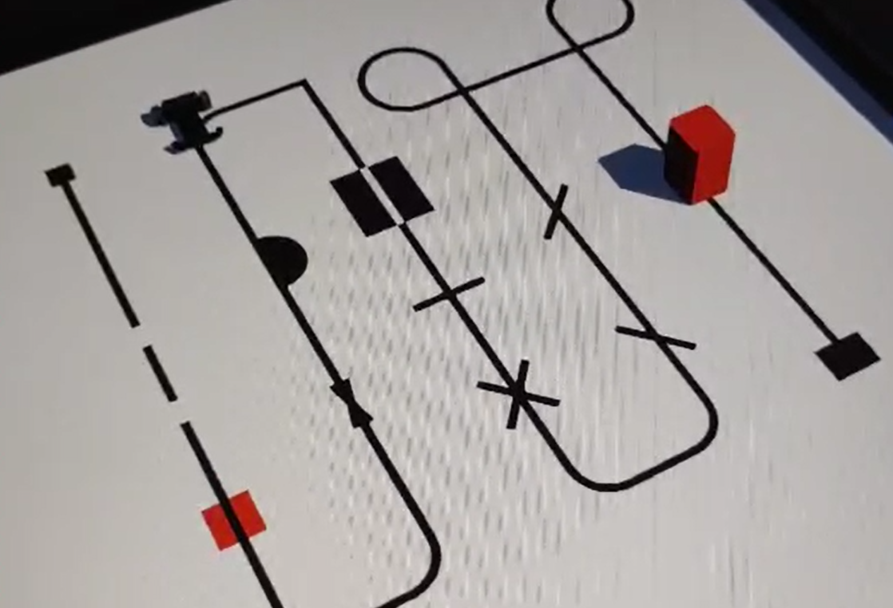

# Line Following Robot Simulation in Webots

## Overview

This project presents a custom line-following robot simulation developed using Webots.

The robot was designed with four IR sensors to detect the path and perform sensor-based movement control using Python programming.

## Project Information

- **Platform:** Webots
- **Robot Type:** Line Following Robot
- **Sensors:** 4 IR Sensors
- **Programming Language:** Python

## Technologies

- Webots
- Python
- Robot Simulation
- IR Sensors
- Robot Control Programming

## Features

- Custom robot design in Webots
- Line detection using IR sensors
- Sensor-based path following
- Real-time robot movement control
- Simulation of robot navigation behavior

## Robot Architecture

- **Robot Model:** Custom designed robot
- **Sensors:** Four IR sensors for path detection
- **Simulation Environment:** Webots world
- **Controller:** Python-based robot control code

## Demo Video

You can watch the simulation demo here:

(videos/film.mp4)

## Project Screenshots

  

## Author

Developed as a robotics simulation project focusing on robot design, sensor-based control, and line-following algorithms using Webots.
